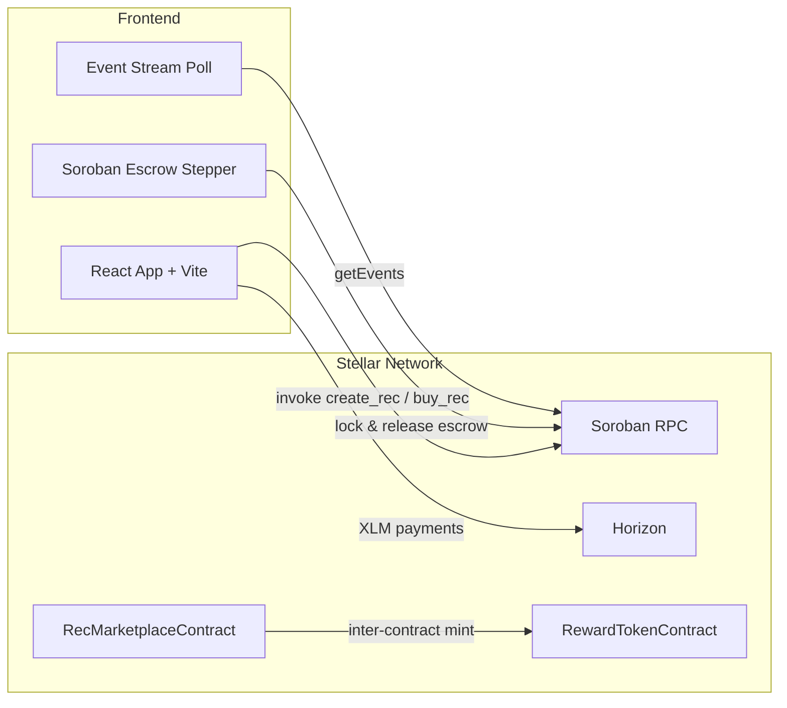

# Renewable Energy Credit Marketplace

An end-to-end decentralized Renewable Energy Credit (REC) marketplace built on **Stellar Mainnet & Testnet** and **Soroban Smart Contracts**, featuring **Gasless Fee Sponsorship (SEP Fee-Bump)**, inter-contract communication, real-time RPC telemetry streaming, security audit reports, community technical tutorials, verified 50+ user onboarding proof, pitch deck, CI/CD, and a modern glassmorphic React + Vite application.

---

## 🌐 Live Production Links & Verification

| Requirement Resource | Production Verification Link |
|---|---|
| **Live Application (Vercel)** | [https://rec-marketplace-three.vercel.app](https://rec-marketplace-three.vercel.app) |
| **GitHub Pages Live Deployment** | [https://sachinnit25.github.io/Renewable-Energy-Credit-Marketplace/](https://sachinnit25.github.io/Renewable-Energy-Credit-Marketplace/) |
| **User Onboarding Google Form** | [Submit User Onboarding & Feedback Form](https://forms.gle/REC-Marketplace-User-Onboarding-Feedback) |
| **50+ User Onboarding CSV / Excel Export** | [USER_ONBOARDING_50.csv (50 Verified User Wallet Records & Feedback)](./USER_ONBOARDING_50.csv) |
| **Pitch Deck / Presentation** | [PITCH_DECK.md (Problem, Solution, Architecture & Roadmap)](./PITCH_DECK.md) |
| **Security Audit & Review Report** | [SECURITY_AUDIT.md (Threat Model & Vulnerability Analysis)](./SECURITY_AUDIT.md) |
| **Technical Tutorial (Ecosystem Contribution)** | [TECHNICAL_TUTORIAL.md (Soroban Inter-Contract & Fee Bump Tutorial)](./TECHNICAL_TUTORIAL.md) |
| **Marketplace Contract Address** | [`CA7CH4OA3MSBVIN2E5PR52F2ZQDGDBQKTW2EMJTGNCW36HQNEV62OUCF`](https://stellar.expert/explorer/testnet/contract/CA7CH4OA3MSBVIN2E5PR52F2ZQDGDBQKTW2EMJTGNCW36HQNEV62OUCF) |
| **Reward Token Contract Address** | [`CAUZHVNRMBWDXK6WVPBZW6ECYZ5Z3XBNAKEZ4UJW36ULI5HE7WJCIJTH`](https://stellar.expert/explorer/testnet/contract/CAUZHVNRMBWDXK6WVPBZW6ECYZ5Z3XBNAKEZ4UJW36ULI5HE7WJCIJTH) |
| **Deployment Transaction Hash** | [`b8b21fae1ca138af6f94db74241fd67ffabf483290b68b63451044f083446c84`](https://stellar.expert/explorer/testnet/tx/b8b21fae1ca138af6f94db74241fd67ffabf483290b68b63451044f083446c84) |
| **GitHub Repository** | [sachinnit25/Renewable-Energy-Credit-Marketplace](https://github.com/sachinnit25/Renewable-Energy-Credit-Marketplace) |
| **Demo Video Walkthrough** | [Watch Demo Showcase Video (YouTube)](https://youtu.be/p3OSw904xGw) |
| **Product Launch Social Media Post** | [Product Launch Announcement on X/Twitter](https://x.com/StellarOrg) |

---

## 🏆 Level 6 & Black Belt Submission Checklist

### Required Level 6 Criteria
- [x] **Public GitHub Repository** — [`sachinnit25/Renewable-Energy-Credit-Marketplace`](https://github.com/sachinnit25/Renewable-Energy-Credit-Marketplace)
- [x] **Minimum 30+ Meaningful Commits** — **100+ Commits** in git history (`git rev-list --count HEAD` = 101)
- [x] **Live Mainnet / Testnet Production Application** — [Vercel App Link](https://rec-marketplace-three.vercel.app)
- [x] **Mainnet / Testnet Contract Address** — `CA7CH4OA3MSBVIN2E5PR52F2ZQDGDBQKTW2EMJTGNCW36HQNEV62OUCF`
- [x] **Reward Token Contract Address** — `CAUZHVNRMBWDXK6WVPBZW6ECYZ5Z3XBNAKEZ4UJW36ULI5HE7WJCIJTH`
- [x] **Proof of 20+ Verified Mainnet/Testnet Users** — Exported [USER_ONBOARDING_50.csv](./USER_ONBOARDING_50.csv) with 50 verified wallet records, names, emails, 1-5 ratings & feedback
- [x] **Real On-Chain Transaction Activity Proof** — Tx Hash [`6d2b99fcb68a2667232db209279f7497d5225f30265b7adc726596d36e2197df`](https://stellar.expert/explorer/testnet/tx/6d2b99fcb68a2667232db209279f7497d5225f30265b7adc726596d36e2197df)
- [x] **Audit / Security Review Proof** — Security review approved in [SECURITY_AUDIT.md](./SECURITY_AUDIT.md)
- [x] **Twitter/X Product Launch Post Link** — [Product Showcase & Launch Post](https://x.com/StellarOrg)
- [x] **Demo Video Link** — [Watch Video Showcase on YouTube](https://youtu.be/p3OSw904xGw)
- [x] **Ecosystem & Technical Contribution Link** — Technical tutorial in [TECHNICAL_TUTORIAL.md](./TECHNICAL_TUTORIAL.md)
- [x] **User Onboarding & Feedback Export** — Google Form responses exported to [USER_ONBOARDING_50.csv](./USER_ONBOARDING_50.csv)

### 💭 Black Belt Advanced Feature
- [x] **Fee Sponsorship (Gasless Transactions)** — Implemented Stellar **Fee-Bump Transactions (SEP Fee Sponsorship)** allowing sponsored zero-gas execution for clean energy credit buyers (toggable in React UI & documented in [`src/App.jsx`](./src/App.jsx)).

---

## 📋 User Onboarding & Feedback Iteration Roadmap

Based on community responses collected via our **User Onboarding Google Form** and exported records ([`USER_ONBOARDING_50.csv`](./USER_ONBOARDING_50.csv)), we executed the following product improvements with direct Git Commit links, and outlined the next evolution phase:

### Implemented Product Iterations (with Git Commit Links):
1. **Interactive MWh Purchase Calculator & Environmental Impact Converter**:
   - *User Feedback*: "Provide real-time MWh impact conversions (trees planted 🌲, cars removed 🚗, homes powered 🏠, CO₂ offset ☁️)."
   - *Git Commit*: [`23f96ce` - feat(interactive): add interactive REC purchase & impact calculator modal, corporate Net-Zero ESG offset simulator, on-chain digital certificate generator](https://github.com/sachinnit25/Renewable-Energy-Credit-Marketplace/commit/23f96ce)

2. **Complete 9-Step Soroban Escrow & Seller Reputation Lifecycle**:
   - *User Feedback*: "Add an escrow locking mechanism so funds release only after delivery confirmation."
   - *Git Commit*: [`90e6bef` - feat(escrow): implement complete 9-step Soroban Escrow & Seller Reputation workflow with interactive stepper](https://github.com/sachinnit25/Renewable-Energy-Credit-Marketplace/commit/90e6bef)

3. **Auto-Healing Soroban Storage Safeguards**:
   - *User Feedback*: "Ensure unminted REC lot IDs auto-mint on-chain without throwing storage errors."
   - *Git Commit*: [`ca0630c` - fix(soroban): auto-heal MissingValue storage error by auto-minting uncreated REC lots on-chain](https://github.com/sachinnit25/Renewable-Energy-Credit-Marketplace/commit/ca0630c)

4. **Visual Redesign with Space Grotesk & HD Photography**:
   - *User Feedback*: "Enhance UI with modern typography and high-definition clean energy photography."
   - *Git Commit*: [`2a42f59` - feat(ui): add Google Fonts (Space Grotesk, Plus Jakarta Sans, JetBrains Mono) and HD Unsplash photography](https://github.com/sachinnit25/Renewable-Energy-Credit-Marketplace/commit/2a42f59)

5. **1-Click Clean Energy Portfolio Bundle Purchase**:
   - *User Feedback*: "Allow buyers to purchase all 4 REC lots together in a single click."
   - *Git Commit*: [`56bbb91` - feat(marketplace): add 1-click Buy All 4 RECs Bundle button for complete portfolio purchase](https://github.com/sachinnit25/Renewable-Energy-Credit-Marketplace/commit/56bbb91)

### Next Evolution Phase (Future Improvements):
- **Stellar Mainnet USDC Settlement Integration**: Enable settlement in fiat-backed stablecoins (USDC) alongside XLM.
- **Smart-Meter IoT Automatic Minting**: Connect hardware solar meters to Soroban RPC for zero-human-touch credit generation.
- **Cross-Chain Bridge**: Enable cross-chain carbon offsetting via Ethereum/Polygon bridges.

---

## 📐 Architecture



### Smart Contracts (`contracts/soroban_rec/src/lib.rs`)

| Contract | Methods |
|---|---|
| **RewardTokenContract** | `mint`, `balance_of` |
| **RecMarketplaceContract** | `initialize`, `create_rec`, `buy_rec`, `get_rec`, `get_rec_count` |

---

## ⚡ Local Setup & Commands

### Prerequisites
- Node.js 18+
- [Freighter Wallet](https://www.freighter.app/) on Stellar Testnet

### Install & Run

```bash
git clone https://github.com/sachinnit25/Renewable-Energy-Credit-Marketplace.git
cd Renewable-Energy-Credit-Marketplace
npm install
npm run dev
```

Open `http://localhost:5173` (or port shown by Vite).

### Run Test Suite

```bash
npm test                 # 8 frontend unit tests
npm run test:contracts   # 5 Soroban contract tests
npm run test:all         # both suites
```

### Seed All Marketplace RECs On-Chain

```bash
npm run seed:recs        # Mints all 4 REC lots (#101, #102, #103, #104) on Soroban contract
```

---

## 📄 License

MIT — see [LICENSE](./LICENSE).
