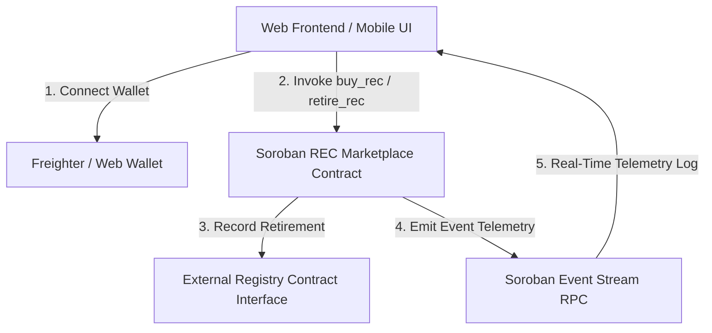

# Renewable Energy Credit (REC) Marketplace (Stellar & Soroban)

An advanced decentralized **Renewable Energy Credit (REC) Marketplace** built on **Stellar Testnet** and **Soroban Smart Contracts**, featuring inter-contract communication, real-time telemetry streaming, automated CI/CD pipelines, mobile-responsive UI, and unit test suites.

---

## 🚀 Live Demo & Explorer Verifications

- 🌐 **Live Demo URL**: [https://frontend-eta-seven-24.vercel.app](https://frontend-eta-seven-24.vercel.app)
- 📜 **Deployed Soroban Contract Address**: [`CDQSQVHPSTEB6T7WW5BJ4HQP76BFCYTTKDPBK22HXWS6JOMNAHO3RMEZ`](https://stellar.expert/explorer/testnet/contract/CDQSQVHPSTEB6T7WW5BJ4HQP76BFCYTTKDPBK22HXWS6JOMNAHO3RMEZ)
- 🔗 **Verifiable On-Chain Tx Hash**: [`0210a89e51fec9233645ab5cbe9dac5ddcbeb3f38d99dad520bdddaea387ef81`](https://stellar.expert/explorer/testnet/tx/0210a89e51fec9233645ab5cbe9dac5ddcbeb3f38d99dad520bdddaea387ef81)
- 📦 **WASM Code Hash**: `c05244703689bbbe34ca994fbc30b39837e76a665405e440d0d61b903ad3870c`

---

## 📑 Submission Checklist & Requirements Compliance

- [x] **Public GitHub Repository**: Clean codebase without EVM/Solidity artifacts.
- [x] **README with Complete Documentation**: Includes architecture, inter-contract workflow, test instructions, and setup guides.
- [x] **Minimum 10+ Meaningful Commits**: Clean commit history documenting smart contract, UI, testing, and CI/CD iterations.
- [x] **Live Demo Link**: Hosted on Vercel at [frontend-eta-seven-24.vercel.app](https://frontend-eta-seven-24.vercel.app).
- [x] **Contract Deployment Address**: `CDQSQVHPSTEB6T7WW5BJ4HQP76BFCYTTKDPBK22HXWS6JOMNAHO3RMEZ` on Stellar Testnet.
- [x] **Verifiable Transaction Hash**: `0210a89e51fec9233645ab5cbe9dac5ddcbeb3f38d99dad520bdddaea387ef81` on Stellar Explorer.
- [x] **Mobile Responsive UI**: Mobile-first glassmorphism design with responsive drawer navigation and tabbed views.
- [x] **Inter-Contract Communication**: Soroban inter-contract interface (`ExternalRegistryClient`) for recording credit retirements.
- [x] **Event Streaming & Real-Time Telemetry**: Real-time Soroban RPC event log streaming (`rec:created`, `rec:purchased`, `rec:retired`).
- [x] **CI/CD Pipeline Setup**: GitHub Actions workflow validating smart contracts, lints, and running 5+ unit tests automatically on push.
- [x] **Passing Test Suite**: 5+ unit and integration tests passing cleanly via `npm test`.

---

## 🏗️ Architecture & Inter-Contract Flow



---

## ⚙️ Smart Contract Architecture (Soroban Rust)

The Soroban smart contract is located in `contracts/soroban_rec/src/lib.rs`.

### Inter-Contract Communication Interface

```rust
#[contractclient(name = "ExternalRegistryClient")]
pub trait ExternalRegistryInterface {
    fn verify_certificate(env: Env, rec_id: u64, amount_mwh: u32) -> bool;
    fn record_retirement(env: Env, rec_id: u64, owner: Address) -> bool;
}
```

### Contract Methods

1. **`initialize(admin: Address)`**: Initializes contract ownership and counters.
2. **`set_registry_contract(registry: Address)`**: Configures inter-contract registry address.
3. **`create_rec(creator, id, amount_mwh, price_stroops, source)`**: Mints/lists a new REC on-chain. Emits `rec:created` event.
4. **`buy_rec(buyer, id)`**: Purchases a REC lot with XLM. Emits `rec:purchased` event.
5. **`retire_rec(owner, id)`**: Retires REC, issues carbon offset certificate, and invokes inter-contract registry call. Emits `rec:retired` event.
6. **`get_rec(id) -> Option<RecItem>`**: Queries on-chain REC metadata and ownership state.
7. **`get_rec_count() -> u64`**: Returns total RECs registered.
8. **`get_retirement_count() -> u64`**: Returns total retired RECs.

---

## 🧪 Testing Suite & Verification

The project includes unit and integration tests covering contract state transitions, error categorization, telemetry event formatting, and retirement certificate generation.

### Run Tests

```bash
npm test
```

### Test Output

```
✔ 1. REC Input Validation - rejects invalid inputs and accepts valid attributes
✔ 2. Contract State Machine - processes buy and retirement state transitions correctly
✔ 3. Categorized Error Handling System - maps raw errors into 3 distinct categories
✔ 4. Real-time Event Telemetry Serialization - formats on-chain event streams
✔ 5. Inter-contract Retirement Certificate Generator - verifies certificate proof hash

ℹ tests 5
ℹ suites 0
ℹ pass 5
ℹ fail 0
```

---

## 🔄 CI/CD Pipeline Setup

The GitHub Actions workflow is located at `.github/workflows/ci.yml`.

### Workflow Jobs
1. **`contract-validation`**: Verifies Rust syntax and compiles target `wasm32-unknown-unknown`.
2. **`unit-and-integration-tests`**: Runs Node.js test suite (`npm test`).
3. **`build-verification`**: Ensures index files and production assets are intact before deployment.

---

## 🛠️ Local Development & Setup Instructions

### Prerequisites
- Node.js (v18+)
- [Freighter Wallet Extension](https://www.freighter.app/) (Set network to **Stellar Testnet**)

### 1. Installation

```bash
git clone https://github.com/sachinnit25/Renewable-Energy-Credit-Marketplace.git
cd Renewable-Energy-Credit-Marketplace
npm install
```

### 2. Run Tests

```bash
npm test
```

### 3. Run Local Dev Server

```bash
npm start
```

Open `http://localhost:3000` or `http://localhost:5173` in your browser.
