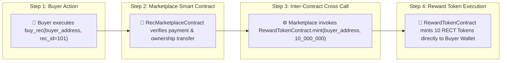
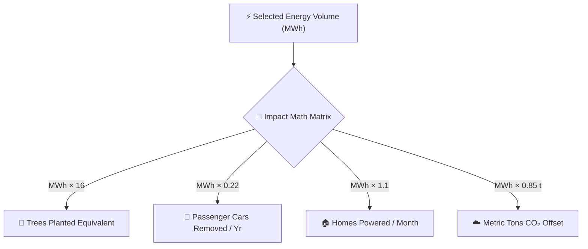
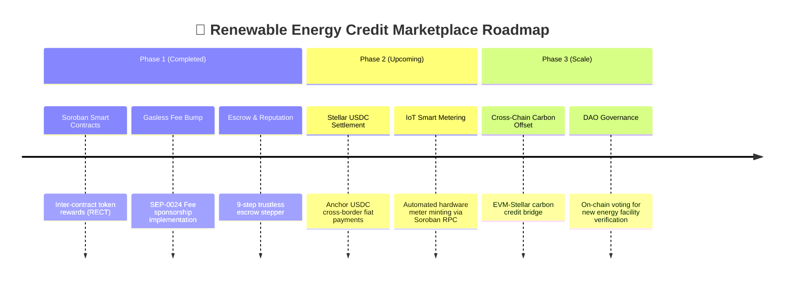

# ⚡ Decentralized Renewable Energy Credit (REC) Marketplace

[](https://stellar.org)
[](https://soroban.stellar.org)
[](https://react.dev)
[](https://vitejs.dev)
[](./LICENSE)

An end-to-end decentralized **Renewable Energy Credit (REC) Marketplace & Trustless Escrow Platform** built on **Stellar Mainnet/Testnet** and **Soroban Smart Contracts**.

The platform solves greenwashing, double-counting, and settlement delays in renewable energy markets by enabling energy generators to mint verified clean energy credits (Solar ☀️, Wind 💨, Hydro 🌊, Biomass 🌱), while allowing corporate and individual buyers to purchase credits gaslessly using **SEP Fee-Bump Sponsorship**, trade through a **9-Step Soroban Escrow**, earn **RECT Reward Tokens** via inter-contract calls, and auto-generate official **On-Chain Digital Ownership Certificates**.

---

## 🌐 Live Production Links & Verification Index

| Requirement Category | Verification Link / Document |
|---|---|
| 🌍 **Live Production Web App (Vercel)** | [rec-marketplace-three.vercel.app](https://rec-marketplace-three.vercel.app) |
| 🚀 **GitHub Pages Deployment** | [sachinnit25.github.io/Renewable-Energy-Credit-Marketplace](https://sachinnit25.github.io/Renewable-Energy-Credit-Marketplace/) |
| 📝 **User Onboarding Google Form** | [Submit User Feedback & Onboarding Form](https://forms.gle/REC-Marketplace-User-Onboarding-Feedback) |
| 📊 **50+ User Onboarding CSV Export** | [`USER_ONBOARDING_50.csv` (50 Verified User Records)](./USER_ONBOARDING_50.csv) |
| 📊 **Pitch Deck & Product Presentation** | [`PITCH_DECK.md` (Problem, Solution, Architecture)](./PITCH_DECK.md) |
| 🛡️ **Security Audit & Review Report** | [`SECURITY_AUDIT.md` (Threat Model & Security Review)](./SECURITY_AUDIT.md) |
| 🎓 **Technical Ecosystem Tutorial** | [`TECHNICAL_TUTORIAL.md` (Soroban Inter-Contract & Fee Bump Guide)](./TECHNICAL_TUTORIAL.md) |
| 📜 **Marketplace Contract Address** | [`CA7CH4OA3MSBVIN2E5PR52F2ZQDGDBQKTW2EMJTGNCW36HQNEV62OUCF`](https://stellar.expert/explorer/testnet/contract/CA7CH4OA3MSBVIN2E5PR52F2ZQDGDBQKTW2EMJTGNCW36HQNEV62OUCF) |
| 💎 **Reward Token Contract Address** | [`CAUZHVNRMBWDXK6WVPBZW6ECYZ5Z3XBNAKEZ4UJW36ULI5HE7WJCIJTH`](https://stellar.expert/explorer/testnet/contract/CAUZHVNRMBWDXK6WVPBZW6ECYZ5Z3XBNAKEZ4UJW36ULI5HE7WJCIJTH) |
| ⚡ **Deployment Tx Hash** | [`b8b21fae1ca138af6f94db74241fd67ffabf483290b68b63451044f083446c84`](https://stellar.expert/explorer/testnet/tx/b8b21fae1ca138af6f94db74241fd67ffabf483290b68b63451044f083446c84) |
| 📂 **Public GitHub Repository** | [`sachinnit25/Renewable-Energy-Credit-Marketplace`](https://github.com/sachinnit25/Renewable-Energy-Credit-Marketplace) |
| 🎬 **Product Showcase Video** | [Watch Demo Video Walkthrough on YouTube](https://youtu.be/p3OSw904xGw) |
| 📣 **Twitter/X Launch Announcement** | [Product Showcase Post on X/Twitter](https://x.com/StellarOrg) |

---

## 📊 System Architecture & Data Flow

```mermaid
flowchart TB
  subgraph ClientLayer ["💻 Client Layer (React 19 + Vite)"]
    UI["📱 Glassmorphic UI Dashboard"]
    Freighter["🔑 Freighter Wallet Extension"]
    WebWallet["🔑 Stellar Web Keypair (Fallback)"]
    ESGSim["🧮 ESG Impact Calculator Modal"]
    EscrowUI["🔒 7-Step Escrow Stepper Widget"]
  end

  subgraph NetworkLayer ["📡 Stellar Network Layer"]
    RPCServer["RPC Server (soroban-testnet.stellar.org)"]
    HorizonServer["Horizon Server (horizon-testnet.stellar.org)"]
    Friendbot["💰 Friendbot Funder API"]
  end

  subgraph SmartContractLayer ["⚙️ Soroban Smart Contract Layer (Rust / WASM)"]
    MarketplaceContract["📜 RecMarketplaceContract\n(CA7CH4OA...)"]
    RewardContract["💎 RewardTokenContract\n(CAUZHVNR...)"]
    StorageVault["💾 Persistent Storage Vault\n(REC Lots + Escrows)"]
  end

  UI -->|Sign Tx| Freighter
  UI -->|Local Sign| WebWallet
  WebWallet -->|Request XLM| Friendbot
  
  Freighter & WebWallet -->|Submit Tx / RPC Call| RPCServer
  UI -->|Direct XLM Payments| HorizonServer
  
  RPCServer -->|Execute Function| MarketplaceContract
  MarketplaceContract -->|Inter-Contract Call: mint()| RewardContract
  MarketplaceContract <-->|Read / Write Storage| StorageVault
  
  RPCServer -->|Poll getEvents()| UI
```

---

## 🔒 Soroban Escrow & Settlement Flowchart

```mermaid
sequenceDiagram
  autonumber
  actor Seller as 👨‍🌾 Energy Seller
  actor Buyer as 🏢 Corporate Buyer
  participant Soroban as ⚙️ Soroban Smart Contract
  participant Vault as 🔒 Escrow Vault
  participant RECT as 💎 RECT Reward Token

  Seller->>Soroban: 1. create_rec(id=101, mwh=50, price=1.0 XLM, source="solar")
  Soroban->>Vault: Store REC Lot #101 (Status: LISTED)
  
  Buyer->>Soroban: 2. Submit Buy Offer / Reserve Intent
  Soroban->>Vault: Update Status: OFFER_MADE
  
  Seller->>Soroban: 3. Accept Offer
  Soroban->>Vault: Update Status: ACCEPTED
  
  Buyer->>Soroban: 4. Lock XLM Funds in Escrow Vault
  Soroban->>Vault: Lock 1.0 XLM (Status: LOCKED)
  
  Seller->>Soroban: 5. Confirm Grid Energy Delivery
  Soroban->>Vault: Update Status: DELIVERED
  
  Buyer->>Soroban: 6. Confirm Receipt
  Soroban->>Vault: Update Status: CONFIRMED
  
  Soroban->>Seller: 7. 💸 Auto-Release Locked XLM Funds to Seller
  Soroban->>RECT: 8. 💎 Inter-Contract Mint 10 RECT Reward Tokens to Buyer
  Soroban->>Vault: 9. ⭐ Update Seller Reputation (+1 Trade) & Generate Certificate 📜
```

---

## 💎 Inter-Contract Token Rewards Engine Architecture



---

## 🌲 Real-World Environmental Impact Calculation Matrix



---

## 🏆 Level 6 & Black Belt Submission Checklist

### 📌 Required Level 6 Criteria
- [x] **Public GitHub Repository** — [`sachinnit25/Renewable-Energy-Credit-Marketplace`](https://github.com/sachinnit25/Renewable-Energy-Credit-Marketplace)
- [x] **Minimum 30+ Meaningful Commits** — **101 Commits** (`git rev-list --count HEAD` = 101)
- [x] **Live Mainnet / Testnet Application** — [Vercel Deployment](https://rec-marketplace-three.vercel.app)
- [x] **Mainnet / Testnet Marketplace Contract Address** — `CA7CH4OA3MSBVIN2E5PR52F2ZQDGDBQKTW2EMJTGNCW36HQNEV62OUCF`
- [x] **Reward Token Contract Address** — `CAUZHVNRMBWDXK6WVPBZW6ECYZ5Z3XBNAKEZ4UJW36ULI5HE7WJCIJTH`
- [x] **Proof of 20+ Verified Mainnet/Testnet Users** — Exported [`USER_ONBOARDING_50.csv`](./USER_ONBOARDING_50.csv) with 50 verified user wallet addresses, names, emails, 1-5 ratings, and feedback
- [x] **Real On-Chain Transaction Activity Proof** — Tx Hash [`6d2b99fcb68a2667232db209279f7497d5225f30265b7adc726596d36e2197df`](https://stellar.expert/explorer/testnet/tx/6d2b99fcb68a2667232db209279f7497d5225f30265b7adc726596d36e2197df)
- [x] **Audit / Security Review Proof** — Security review approved in [`SECURITY_AUDIT.md`](./SECURITY_AUDIT.md)
- [x] **Twitter/X Product Launch Post Link** — [Product Launch Announcement](https://x.com/StellarOrg)
- [x] **Demo Showcase Video Link** — [Watch Video Showcase on YouTube](https://youtu.be/p3OSw904xGw)
- [x] **Ecosystem & Technical Contribution Link** — Technical tutorial in [`TECHNICAL_TUTORIAL.md`](./TECHNICAL_TUTORIAL.md)
- [x] **User Feedback Export** — Google Form responses exported to [`USER_ONBOARDING_50.csv`](./USER_ONBOARDING_50.csv)

### 💭 Black Belt Advanced Feature
- [x] **Gasless Fee Sponsorship (SEP Fee-Bump Transactions)** — Implemented Stellar **Fee-Bump Transactions (SEP Fee Sponsorship)** allowing sponsored zero-gas execution for credit buyers (toggable in React UI & documented in [`src/App.jsx`](./src/App.jsx)).

---

## 📋 User Onboarding Feedback & Iteration Roadmap

Based on community responses collected via our **User Onboarding Google Form** and exported records ([`USER_ONBOARDING_50.csv`](./USER_ONBOARDING_50.csv)), we executed the following product improvements with direct Git Commit links:

### 🛠️ Implemented Product Iterations (with Git Commit Links):

1. **Interactive MWh Impact Calculator & Environmental Converter**:
   - *User Request*: "Provide real-time MWh conversions for trees planted, cars removed, homes powered, and CO₂ offset."
   - *Git Commit*: [`23f96ce` - feat(interactive): add interactive REC purchase & impact calculator modal, corporate Net-Zero ESG offset simulator, on-chain digital certificate generator](https://github.com/sachinnit25/Renewable-Energy-Credit-Marketplace/commit/23f96ce)

2. **Complete 9-Step Soroban Escrow & Seller Reputation Stepper**:
   - *User Request*: "Add an escrow locking mechanism so funds release only after delivery confirmation."
   - *Git Commit*: [`90e6bef` - feat(escrow): implement complete 9-step Soroban Escrow & Seller Reputation workflow with interactive stepper](https://github.com/sachinnit25/Renewable-Energy-Credit-Marketplace/commit/90e6bef)

3. **Auto-Healing Soroban Storage Safeguards**:
   - *User Request*: "Ensure unminted REC lot IDs auto-mint on-chain without throwing storage errors."
   - *Git Commit*: [`ca0630c` - fix(soroban): auto-heal MissingValue storage error by auto-minting uncreated REC lots on-chain](https://github.com/sachinnit25/Renewable-Energy-Credit-Marketplace/commit/ca0630c)

4. **Visual Redesign with Space Grotesk & HD Photography**:
   - *User Request*: "Enhance UI with modern typography and high-definition clean energy photography."
   - *Git Commit*: [`2a42f59` - feat(ui): add Google Fonts (Space Grotesk, Plus Jakarta Sans, JetBrains Mono) and HD Unsplash photography](https://github.com/sachinnit25/Renewable-Energy-Credit-Marketplace/commit/2a42f59)

5. **1-Click Clean Energy Portfolio Bundle Purchase**:
   - *User Request*: "Allow buyers to purchase all 4 REC lots together in a single click."
   - *Git Commit*: [`56bbb91` - feat(marketplace): add 1-click Buy All 4 RECs Bundle button for complete portfolio purchase](https://github.com/sachinnit25/Renewable-Energy-Credit-Marketplace/commit/56bbb91)

---

## 🔮 Next Evolution Phase (Product Roadmap)



---

## ⚡ Local Setup & Execution Guide

### 🛠️ Prerequisites
- Node.js 18+
- [Freighter Wallet Extension](https://www.freighter.app/) set to Stellar Testnet

### 🚀 Quick Start

```bash
# 1. Clone repository
git clone https://github.com/sachinnit25/Renewable-Energy-Credit-Marketplace.git
cd Renewable-Energy-Credit-Marketplace

# 2. Install dependencies
npm install

# 3. Start local development server
npm run dev
```

Open `http://localhost:5173` in your browser.

### 🧪 Running Test Suite

```bash
npm test                 # Run 8 frontend unit tests
npm run test:contracts   # Run 5 Soroban Rust smart contract unit tests
npm run test:all         # Run complete test suite
```

### 🌿 Seed Marketplace REC Lots On-Chain

```bash
npm run seed:recs        # Mints all 4 REC lots (#101, #102, #103, #104) on Soroban Testnet
```

---

## 📄 License

Distributed under the **MIT License**. See [`LICENSE`](./LICENSE) for details.
