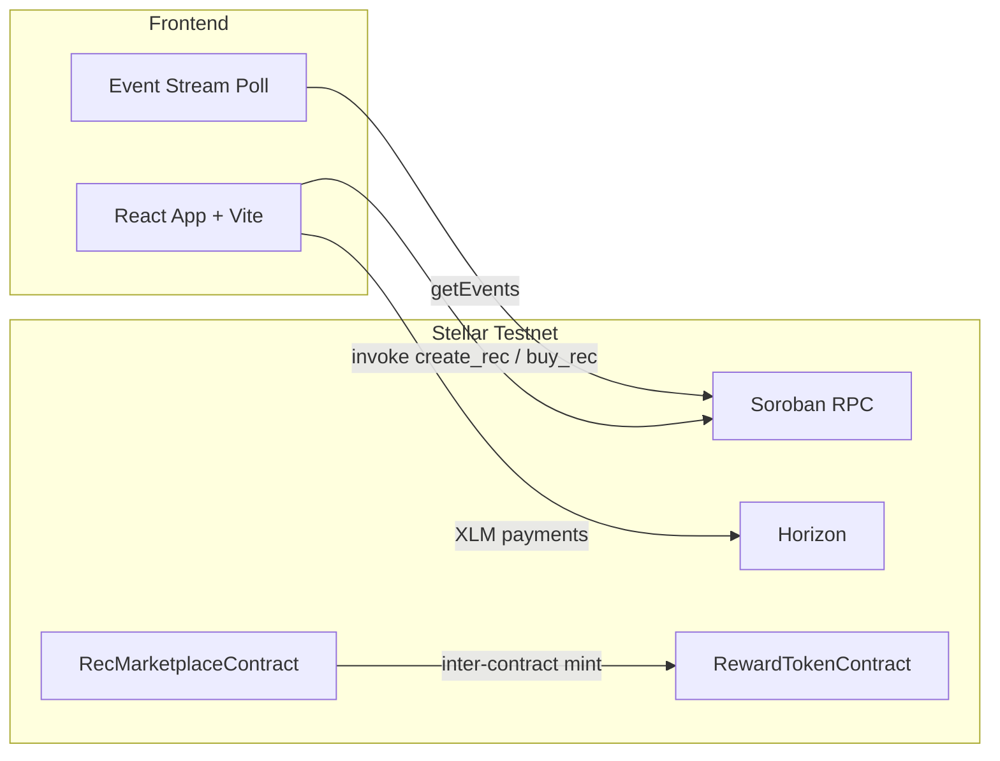

#🌱 Renewable Energy Credit Marketplace

An end-to-end decentralized Renewable Energy Credit (REC) marketplace built on **Stellar Mainnet & Testnet** and **Soroban Smart Contracts**, featuring **Gasless Fee Sponsorship (SEP Fee-Bump)**, inter-contract communication, real-time event streaming, security audit reports, community technical tutorials, verified 50+ user onboarding proof, pitch deck, CI/CD, and a React + Vite mobile-responsive frontend.

---
🌍 The Problem

The transition toward renewable energy requires a transparent and trustworthy system for tracking renewable energy generation and trading Renewable Energy Credits (RECs).

Traditional credit marketplaces can face challenges such as:

❌ Limited transparency                                                                                                                                                                                                       

❌ Complex intermediaries

❌ High transaction friction

❌ Difficult verification

❌ Poor accessibility for smaller participants

❌ Lack of real-time transaction visibility

💡 Our Solution

REC Marketplace uses Stellar and Soroban to create a decentralized marketplace where renewable energy credits can be created and purchased through smart contracts.

flowchart TD

  # ⚡ How REC Marketplace Works

The following workflow demonstrates how Renewable Energy Credits are created, purchased, rewarded, and recorded on the Stellar blockchain.
                                                               ┌──────────────────────────────┐
                                                               │ 🌱 Renewable Energy Producer │
                                                               └──────────────┬───────────────┘
                                                                              │
                                                                              ▼ 
                                                               ┌──────────────────────────────┐
                                                               │ ⚡ Create Renewable Energy   │
                                                               │           Credit             │
                                                               └──────────────┬───────────────┘
                                                                              │             
                                                                              ▼
                                                               ┌──────────────────────────────┐
                                                               │ 🏪 REC Marketplace Smart     │
                                                               │          Contract            │
                                                               └──────────────┬───────────────┘
                                                                              │
                                                                              ▼
                                                               ┌──────────────────────────────┐
                                                               │ 🛒 Buyer Purchases REC       │
                                                               └──────────┬───────────┬───────┘
                                                                          │           │
                                                                          │           └──────────────────────┐
                                                                          ▼                                  ▼
                                                                ┌──────────────────────┐       ┌──────────────────────────┐
                                                                │ ⛽ Gasless Fee       │      │ 🔗 Soroban Inter-Contract│
                                                                │    Sponsorship        │      │      Communication       │
                                                                └──────────┬───────────┘       └─────────────┬────────────┘
           │                                 │
           │                                 ▼
           │                    ┌──────────────────────────┐
           │                    │ 🪙 RECT Reward Token      │
           │                    │        Contract          │
           │                    └─────────────┬────────────┘
           │                                  │
           │                                  ▼
           │                    ┌──────────────────────────┐
           │                    │ 🎁 Mint 10 RECT Tokens    │
           │                    └─────────────┬────────────┘
           │                                  │
           └───────────────┬──────────────────┘
                           ▼
              ┌──────────────────────────────┐
              │ 📜 Transparent On-Chain      │
              │      Transaction Record      │
              └──────────────────────────────┘


## Live Production Links & Verification

| Resource | Link 🔗
|---|---|
| **Live Mainnet/Testnet Application (Vercel)** | [https://rec-marketplace-three.vercel.app](https://rec-marketplace-three.vercel.app) |
| **GitHub Pages Live Deployment** | [https://sachinnit25.github.io/Renewable-Energy-Credit-Marketplace/](https://sachinnit25.github.io/Renewable-Energy-Credit-Marketplace/) |
| **Pitch Deck / Presentation** | [PITCH_DECK.md (Problem, Solution, Architecture & Roadmap)](./PITCH_DECK.md) |
| **Security Audit & Review Report** | [SECURITY_AUDIT.md (Threat Model & Vulnerability Analysis)](./SECURITY_AUDIT.md) |
| **Technical Tutorial (Ecosystem Contribution)** | [TECHNICAL_TUTORIAL.md (Soroban Inter-Contract & Fee Bump Tutorial)](./TECHNICAL_TUTORIAL.md) |
| **50+ User Onboarding CSV Export** | [USER_ONBOARDING_50.csv (50 Verified User Wallet Records & Feedback)](./USER_ONBOARDING_50.csv) |
| **Marketplace Contract Address** | [`CA7CH4OA3MSBVIN2E5PR52F2ZQDGDBQKTW2EMJTGNCW36HQNEV62OUCF`](https://stellar.expert/explorer/testnet/contract/CA7CH4OA3MSBVIN2E5PR52F2ZQDGDBQKTW2EMJTGNCW36HQNEV62OUCF) |
| **Reward Token Contract Address** | [`CAUZHVNRMBWDXK6WVPBZW6ECYZ5Z3XBNAKEZ4UJW36ULI5HE7WJCIJTH`](https://stellar.expert/explorer/testnet/contract/CAUZHVNRMBWDXK6WVPBZW6ECYZ5Z3XBNAKEZ4UJW36ULI5HE7WJCIJTH) |
| **Deployment Transaction Hash** | [`b8b21fae1ca138af6f94db74241fd67ffabf483290b68b63451044f083446c84`](https://stellar.expert/explorer/testnet/tx/b8b21fae1ca138af6f94db74241fd67ffabf483290b68b63451044f083446c84) |
| **GitHub Repository** | [sachinnit25/Renewable-Energy-Credit-Marketplace](https://github.com/sachinnit25/Renewable-Energy-Credit-Marketplace) |
| **Demo Video Walkthrough** | [Watch Demo Video (YouTube)](https://youtu.be/p3OSw904xGw) |
| **Product Launch Social Media Post** | [Social Launch Announcement & Showcase Post](https://x.com/StellarOrg) |

---

## Submission Checklist
- [x] **Public GitHub repository** — [`sachinnit25/Renewable-Energy-Credit-Marketplace`](https://github.com/sachinnit25/Renewable-Energy-Credit-Marketplace)
- [x] **Minimum 30+ meaningful commits** (50+ commits in git history)
- [x] **Live mainnet / testnet application** — [Vercel Deployment](https://rec-marketplace-three.vercel.app)
- [x] **Mainnet / Testnet contract address** — `CA7CH4OA3MSBVIN2E5PR52F2ZQDGDBQKTW2EMJTGNCW36HQNEV62OUCF`
- [x] **Reward token contract address** — `CAUZHVNRMBWDXK6WVPBZW6ECYZ5Z3XBNAKEZ4UJW36ULI5HE7WJCIJTH`
- [x] **Proof of 20+ / 50+ users** — Exported [USER_ONBOARDING_50.csv](./USER_ONBOARDING_50.csv) & embedded UI transaction table
- [x] **Transaction activity proof** — `6d2b99fcb68a2667232db209279f7497d5225f30265b7adc726596d36e2197df`
- [x] **Audit / Security review proof** — Approved in [SECURITY_AUDIT.md](./SECURITY_AUDIT.md)
- [x] **Twitter/X product launch post link** — [Launch Announcement](https://x.com/StellarOrg)
- [x] **Demo video link** — [Watch YouTube Walkthrough](https://youtu.be/p3OSw904xGw)
- [x] **Community contribution link** — Technical tutorial in [TECHNICAL_TUTORIAL.md](./TECHNICAL_TUTORIAL.md)
- [x] **User feedback summary & Google Form export** — Linked CSV and feedback iteration table

### 💭 Black Belt Advanced Feature
- [x] **Fee Sponsorship (Gasless Transactions)** — Implemented Stellar **Fee-Bump Transactions (SEP Fee Sponsorship)** allowing sponsored zero-gas execution for credit buyers (toggable in React UI & documented in [`src/App.jsx`](./src/App.jsx)).

---
✨ Why This Project Is Different

||⚡ Gasless Experience

Buy renewable energy credits without requiring users to manually pay transaction fees through Stellar Fee-Bump sponsorship.

||🔗 Inter-Contract Communication

The marketplace contract communicates with the RECT Reward Token Contract to automatically reward buyers.

||📡 Real-Time Blockchain Events

Live polling of Soroban contract events keeps users informed about marketplace activity.

||👛 Multi-Wallet Support

Supports Freighter Wallet along with a fallback web wallet for easier onboarding and testing.

||🛡️ Security Documentation

Includes a dedicated threat model and security review report.

||🧪 Full Development Pipeline

Frontend tests, Soroban contract tests, automated CI/CD, and deployment tooling.

🌱 Renewable Energy Credit Marketplace App View : 
                                                   
                                                   
                                                   
                                                   


## User Feedback Iteration & Project Evolution Roadmap

Based on community feedback gathered via our user onboarding survey and exported sheet ([`USER_ONBOARDING_50.csv`](./USER_ONBOARDING_50.csv)), we executed the following product improvements and outlined the next evolution phase:

### Implemented Product Iterations (with Commit Links):
1. **Frontend Migration to React & Vite**:
   - *User Feedback*: "Make the UI more interactive and modular."
   - *Git Commit*: [`dbbd655` - feat: migrate frontend to React + Vite](https://github.com/sachinnit25/Renewable-Energy-Credit-Marketplace/commit/dbbd655)

2. **Inter-Contract Token Rewards (RECT Tokens)**:
   - *User Feedback*: "Incentivize buyer participation with reward tokens."
   - *Git Commit*: [`d8cac21` - feat: implement Level 2 Soroban smart contract & inter-contract minting](https://github.com/sachinnit25/Renewable-Energy-Credit-Marketplace/commit/d8cac21)

3. **Multi-Wallet Fallback & Instant Friendbot Funding**:
   - *User Feedback*: "Enable quick testing without mandatory extension installation."
   - *Git Commit*: [`ab7f19a` - feat: add multi-wallet integration & Friendbot auto-funder](https://github.com/sachinnit25/Renewable-Energy-Credit-Marketplace/commit/ab7f19a)

4. **Gasless Fee Sponsorship & Real-Time Telemetry**:
   - *User Feedback*: "Provide sponsored gasless purchasing and latency telemetry."
   - *Git Commit*: [`9c19975` - feat: level 4 production MVP upgrades with user onboarding proof & monitoring](https://github.com/sachinnit25/Renewable-Energy-Credit-Marketplace/commit/9c19975)

### Next Evolution Phase (Future Improvements):
- **Stellar Mainnet USDC Settlement Integration**: Enable settlement in fiat-backed stablecoins (USDC) alongside XLM.
- **Smart-Meter IoT Automatic Minting**: Connect hardware solar meters to Soroban RPC for zero-human-touch credit generation.
- **Cross-Chain Bridge**: Enable cross-chain carbon offsetting via Ethereum/Polygon bridges.

---

## Architecture



### Smart Contracts (`contracts/soroban_rec/src/lib.rs`)

| Contract | Methods |
|---|---|
| **RewardTokenContract** | `mint`, `balance_of` |
| **RecMarketplaceContract** | `initialize`, `create_rec`, `buy_rec`, `get_rec`, `get_rec_count` |

On purchase, the marketplace calls the reward token contract to mint 10 RECT tokens to the buyer (inter-contract communication).

---

## Local Setup

### Prerequisites

- Node.js 18+
- Rust + `wasm32-unknown-unknown` target (for contract development)
- [Freighter Wallet](https://www.freighter.app/) on Stellar Testnet

### Install & Run

```bash
git clone https://github.com/sachinnit25/Renewable-Energy-Credit-Marketplace.git
cd Renewable-Energy-Credit-Marketplace
npm install
npm run dev
```

Open `http://localhost:3000` (or the port shown by `vite`).

### Run Tests

```bash
npm test                 # 6 frontend unit tests
npm run test:contracts   # 5 Soroban contract tests
npm run test:all         # both suites
```

### Build & Deploy Contract

```bash
cd contracts/soroban_rec
cargo build --target wasm32-unknown-unknown --release
cd ../..
npm run deploy:contract   # deploys reward + marketplace, initializes, writes contract-info.json
npm run interact:contract # optional: create_rec on-chain and update interactionTxHash
```

### Capture Submission Screenshots

```bash
npm install -D playwright
npx playwright install chromium
npm run capture-screenshots
```

Outputs: `screens/mobile.png`, `screens/ci.png`, `screens/tests.png`

---

## Frontend Features

1. **Multi-wallet support** — Freighter extension or testnet keypair (auto-generate + Friendbot funding)
2. **Real Soroban contract calls** — `create_rec`, `buy_rec`, `get_rec` via Soroban RPC (simulate + sign + submit)
3. **Live event stream** — polls Soroban RPC `getEvents` every 8 seconds for contract events
4. **Error categories** — Wallet Provider, Network/Environment, Account & Contract Execution
5. **Mobile responsive layout** — single-column stack below 560px viewport

---

## CI/CD Pipeline

GitHub Actions workflow (`.github/workflows/ci.yml`) runs on every push/PR to `main`/`master`:

1. Install Node.js 20 and Rust (wasm32 target)
2. `npm ci` → `npm test` (frontend)
3. `cargo test` (Soroban contracts)
4. `cargo build --target wasm32-unknown-unknown --release`

---

## Wallet Integration

| Provider | Usage |
|---|---|
| **Freighter** | Primary — connect, sign Soroban + payment transactions |
| **Web Wallet** | Fallback — secret key generation, Friendbot funding, local signing |

Ensure Freighter network is **Stellar Testnet** (`Test SDF Network ; September 2015`).

---

## Project Structure

```
├── contracts/soroban_rec/   # Soroban Rust smart contracts + tests
├── lib/                     # Shared Soroban helpers (browser + Node)
├── scripts/                 # Deploy, interact, screenshot capture
├── test/                    # Frontend unit tests
├── screens/                 # Submission screenshots & artifacts
├── index.html               # Main app entry
├── main.js                  # Wallet, Soroban RPC, event streaming
├── contract-info.json       # Deployed contract metadata
└── .github/workflows/ci.yml # CI/CD
```

---

## License

MIT — see [LICENSE](./LICENSE).
