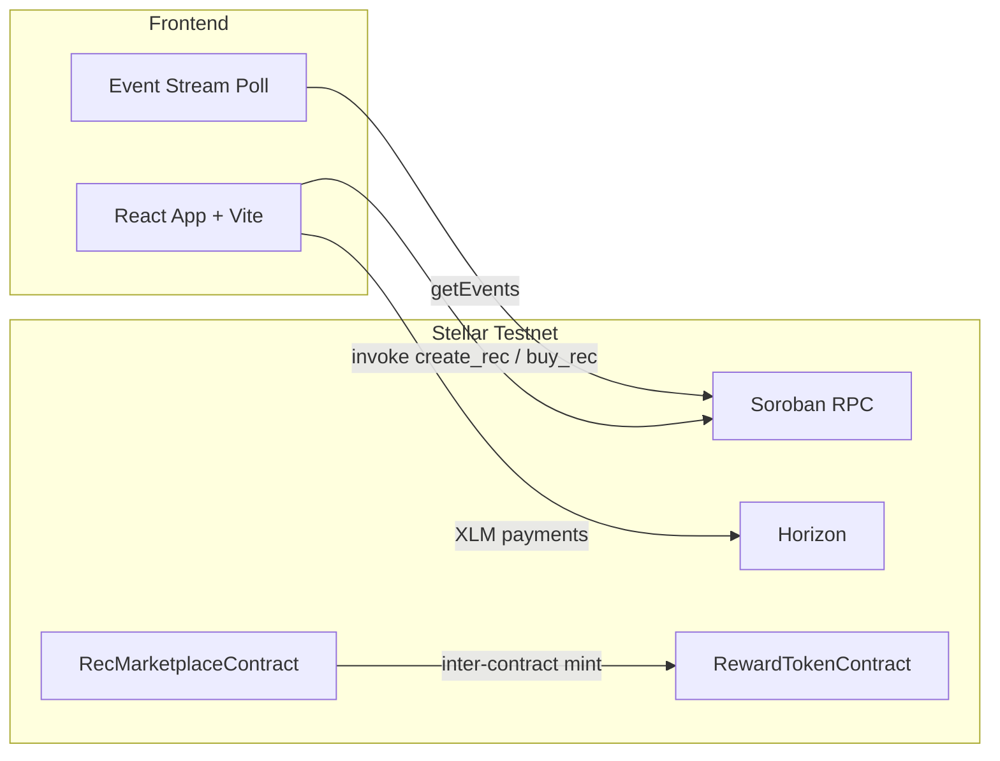

# Renewable Energy Credit Marketplace (Stellar & Soroban)

An end-to-end decentralized Renewable Energy Credit (REC) marketplace built on **Stellar Testnet** and **Soroban Smart Contracts**, featuring inter-contract communication, real-time event streaming, CI/CD, and a mobile-responsive frontend.

---

## Live Demo & On-Chain Verification

| Resource | Link |
|---|---|
| **Live Demo** | [https://rec-marketplace-three.vercel.app](https://rec-marketplace-three.vercel.app) |
| **Marketplace Contract** | [`CDQSQVHPSTEB6T7WW5BJ4HQP76BFCYTTKDPBK22HXWS6JOMNAHO3RMEZ`](https://stellar.expert/explorer/testnet/contract/CDQSQVHPSTEB6T7WW5BJ4HQP76BFCYTTKDPBK22HXWS6JOMNAHO3RMEZ) |
| **Deployment Tx Hash** | [`0210a89e51fec9233645ab5cbe9dac5ddcbeb3f38d99dad520bdddaea387ef81`](https://stellar.expert/explorer/testnet/tx/0210a89e51fec9233645ab5cbe9dac5ddcbeb3f38d99dad520bdddaea387ef81) |
| **GitHub Repository** | [sachinnit25/Renewable-Energy-Credit-Marketplace](https://github.com/sachinnit25/Renewable-Energy-Credit-Marketplace) |
| **Demo Video** | [Watch Demo Video (YouTube)](https://youtu.be/p3OSw904xGw) |

---

## Submission Checklist

### Required

- [x] **Public GitHub repository**
- [x] **README with complete documentation** (this file)
- [x] **Minimum 10+ meaningful commits** (19+ commits in history)
- [x] **Live demo link** — [Vercel deployment](https://rec-marketplace-three.vercel.app)
- [x] **Contract deployment address** — see [contract-info.json](./contract-info.json)
- [x] **Transaction hash for contract interaction** — see `interactionTxHash` in contract-info.json
- [x] **Screenshot: mobile responsive UI** — [`screens/mobile.png`](./screens/mobile.png)
- [x] **Screenshot: CI/CD pipeline** — [`screens/ci.png`](./screens/ci.png)
- [x] **Screenshot: test output (3+ passing tests)** — [`screens/tests.png`](./screens/tests.png)
- [x] **Demo video link (1–2 min)** — [Watch YouTube Demo](https://youtu.be/p3OSw904xGw)

### Technical Requirements

- [x] **Advanced smart contract development** — Soroban Rust contracts with storage, auth, events
- [x] **Inter-contract communication** — `buy_rec` invokes `RewardTokenContract::mint`
- [x] **Event streaming & real-time updates** — Soroban RPC `getEvents` polling in frontend
- [x] **CI/CD pipeline** — [`.github/workflows/ci.yml`](./.github/workflows/ci.yml)
- [x] **Smart contract deployment workflow** — [`scripts/deploy_soroban.mjs`](./scripts/deploy_soroban.mjs)
- [x] **Mobile responsive frontend** — CSS breakpoints at 900px and 560px
- [x] **Error handling & loading states** — 3 categorized error types + pending/success UI
- [x] **Tests for contracts and frontend** — 5 Rust tests + 6 JS tests
- [x] **Production-ready architecture** — separated `lib/`, deployment scripts, contract metadata
- [x] **Documentation & demo presentation** — README, DEMO_SCRIPT, CONTRIBUTING

---

## Architecture



### Smart Contracts (`contracts/soroban_rec/src/lib.rs`)

| Contract | Methods |
|---|---|
| **RewardTokenContract** | `mint`, `balance_of` |
| **RecMarketplaceContract** | `initialize`, `create_rec`, `buy_rec`, `get_rec`, `get_rec_count` |

On purchase, the marketplace calls the reward token contract to mint 10 RECT tokens to the buyer (inter-contract communication).

---

## Local Setup

### Prerequisites

- Node.js 18+
- Rust + `wasm32-unknown-unknown` target (for contract development)
- [Freighter Wallet](https://www.freighter.app/) on Stellar Testnet

### Install & Run

```bash
git clone https://github.com/sachinnit25/Renewable-Energy-Credit-Marketplace.git
cd Renewable-Energy-Credit-Marketplace
npm install
npm run dev
```

Open `http://localhost:3000` (or the port shown by `vite`).

### Run Tests

```bash
npm test                 # 6 frontend unit tests
npm run test:contracts   # 5 Soroban contract tests
npm run test:all         # both suites
```

### Build & Deploy Contract

```bash
cd contracts/soroban_rec
cargo build --target wasm32-unknown-unknown --release
cd ../..
npm run deploy:contract   # deploys reward + marketplace, initializes, writes contract-info.json
npm run interact:contract # optional: create_rec on-chain and update interactionTxHash
```

### Capture Submission Screenshots

```bash
npm install -D playwright
npx playwright install chromium
npm run capture-screenshots
```

Outputs: `screens/mobile.png`, `screens/ci.png`, `screens/tests.png`

---

## Frontend Features

1. **Multi-wallet support** — Freighter extension or testnet keypair (auto-generate + Friendbot funding)
2. **Real Soroban contract calls** — `create_rec`, `buy_rec`, `get_rec` via Soroban RPC (simulate + sign + submit)
3. **Live event stream** — polls Soroban RPC `getEvents` every 8 seconds for contract events
4. **Error categories** — Wallet Provider, Network/Environment, Account & Contract Execution
5. **Mobile responsive layout** — single-column stack below 560px viewport

---

## CI/CD Pipeline

GitHub Actions workflow (`.github/workflows/ci.yml`) runs on every push/PR to `main`/`master`:

1. Install Node.js 20 and Rust (wasm32 target)
2. `npm ci` → `npm test` (frontend)
3. `cargo test` (Soroban contracts)
4. `cargo build --target wasm32-unknown-unknown --release`

---

## Wallet Integration

| Provider | Usage |
|---|---|
| **Freighter** | Primary — connect, sign Soroban + payment transactions |
| **Web Wallet** | Fallback — secret key generation, Friendbot funding, local signing |

Ensure Freighter network is **Stellar Testnet** (`Test SDF Network ; September 2015`).

---

## Project Structure

```
├── contracts/soroban_rec/   # Soroban Rust smart contracts + tests
├── lib/                     # Shared Soroban helpers (browser + Node)
├── scripts/                 # Deploy, interact, screenshot capture
├── test/                    # Frontend unit tests
├── screens/                 # Submission screenshots & artifacts
├── index.html               # Main app entry
├── main.js                  # Wallet, Soroban RPC, event streaming
├── contract-info.json       # Deployed contract metadata
└── .github/workflows/ci.yml # CI/CD
```

---

## License

MIT — see [LICENSE](./LICENSE).
