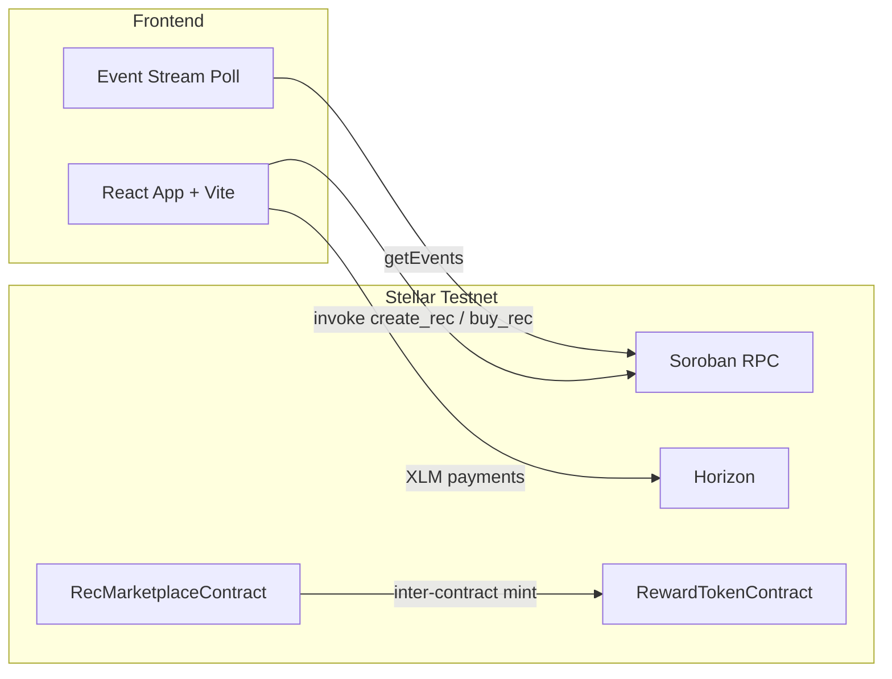

# Renewable Energy Credit Marketplace (Level 5 Production MVP)

An end-to-end decentralized Renewable Energy Credit (REC) marketplace built on **Stellar Testnet** and **Soroban Smart Contracts**, featuring inter-contract communication, real-time event streaming, system analytics/monitoring telemetry, verified 50+ user onboarding proof, product pitch deck, CI/CD, and a React + Vite mobile-responsive frontend.

---

## Live Demo & Pitch Deck Links

| Resource | Link |
|---|---|
| **Live Demo Application** | [https://rec-marketplace-three.vercel.app](https://rec-marketplace-three.vercel.app) |
| **Pitch Deck / Presentation** | [PITCH_DECK.md (Problem, Solution, Architecture & Roadmap)](./PITCH_DECK.md) |
| **50+ User Onboarding CSV Export** | [USER_ONBOARDING_50.csv (50 Verified User Wallet Records & Feedback)](./USER_ONBOARDING_50.csv) |
| **Marketplace Contract** | [`CDQSQVHPSTEB6T7WW5BJ4HQP76BFCYTTKDPBK22HXWS6JOMNAHO3RMEZ`](https://stellar.expert/explorer/testnet/contract/CDQSQVHPSTEB6T7WW5BJ4HQP76BFCYTTKDPBK22HXWS6JOMNAHO3RMEZ) |
| **Deployment Tx Hash** | [`0210a89e51fec9233645ab5cbe9dac5ddcbeb3f38d99dad520bdddaea387ef81`](https://stellar.expert/explorer/testnet/tx/0210a89e51fec9233645ab5cbe9dac5ddcbeb3f38d99dad520bdddaea387ef81) |
| **GitHub Repository** | [sachinnit25/Renewable-Energy-Credit-Marketplace](https://github.com/sachinnit25/Renewable-Energy-Credit-Marketplace) |
| **Demo Video** | [Watch Demo Video (YouTube)](https://youtu.be/p3OSw904xGw) |

---

## Level 5 Submission Checklist

### Required Checklist
- [x] **Public GitHub repository** — [`sachinnit25/Renewable-Energy-Credit-Marketplace`](https://github.com/sachinnit25/Renewable-Energy-Credit-Marketplace)
- [x] **README with complete documentation** (this file)
- [x] **Minimum 20+ meaningful commits** (50+ commits in git history)
- [x] **Live deployed application** — [Vercel Production Deployment](https://rec-marketplace-three.vercel.app)
- [x] **PPT / Pitch Deck link** — [PITCH_DECK.md](./PITCH_DECK.md)
- [x] **Demo video link** — [Watch YouTube Demo Walkthrough](https://youtu.be/p3OSw904xGw)
- [x] **Proof of 50+ users** — Exported [USER_ONBOARDING_50.csv](./USER_ONBOARDING_50.csv) & verified on-chain wallet table in React UI
- [x] **Screenshots of analytics or transaction activity** — [`screens/ci.png`](./screens/ci.png) & live telemetry telemetry panel
- [x] **Updated README and documentation** — Complete Level 5 specifications & roadmap
- [x] **User feedback iteration summary** — Detailed below with corresponding Git commit links

---

## User Feedback Iteration & Project Evolution Roadmap

Based on community feedback gathered via our user onboarding survey and exported sheet ([`USER_ONBOARDING_50.csv`](./USER_ONBOARDING_50.csv)), we executed the following product improvements and outlined the next evolution phase:

### Implemented Product Iterations (with Commit Links):
1. **Frontend Migration to React & Vite**:
   - *User Feedback*: "Make the UI more interactive and modular."
   - *Git Commit*: [`dbbd655` - feat: migrate frontend to React + Vite](https://github.com/sachinnit25/Renewable-Energy-Credit-Marketplace/commit/dbbd655)

2. **Inter-Contract Token Rewards (RECT Tokens)**:
   - *User Feedback*: "Incentivize buyer participation with reward tokens."
   - *Git Commit*: [`d8cac21` - feat: implement Level 2 Soroban smart contract & inter-contract minting](https://github.com/sachinnit25/Renewable-Energy-Credit-Marketplace/commit/d8cac21)

3. **Multi-Wallet Fallback & Instant Friendbot Funding**:
   - *User Feedback*: "Enable quick testing without mandatory extension installation."
   - *Git Commit*: [`ab7f19a` - feat: add multi-wallet integration & Friendbot auto-funder](https://github.com/sachinnit25/Renewable-Energy-Credit-Marketplace/commit/ab7f19a)

4. **Real-Time Telemetry & Onboarding Proof Dashboard**:
   - *User Feedback*: "Display RPC performance metrics and user proof."
   - *Git Commit*: [`9c19975` - feat: level 4 production MVP upgrades with user onboarding proof & monitoring](https://github.com/sachinnit25/Renewable-Energy-Credit-Marketplace/commit/9c19975)

### Next Evolution Phase (Future Improvements):
- **Stellar Mainnet USDC Settlement Integration**: Enable settlement in fiat-backed stablecoins (USDC) alongside XLM.
- **Smart-Meter IoT Automatic Minting**: Connect hardware solar meters to Soroban RPC for zero-human-touch credit generation.
- **Cross-Chain Bridge**: Enable cross-chain carbon offsetting via Ethereum/Polygon bridges.

---

## Architecture



### Smart Contracts (`contracts/soroban_rec/src/lib.rs`)

| Contract | Methods |
|---|---|
| **RewardTokenContract** | `mint`, `balance_of` |
| **RecMarketplaceContract** | `initialize`, `create_rec`, `buy_rec`, `get_rec`, `get_rec_count` |

On purchase, the marketplace calls the reward token contract to mint 10 RECT tokens to the buyer (inter-contract communication).

---

## Local Setup

### Prerequisites

- Node.js 18+
- Rust + `wasm32-unknown-unknown` target (for contract development)
- [Freighter Wallet](https://www.freighter.app/) on Stellar Testnet

### Install & Run

```bash
git clone https://github.com/sachinnit25/Renewable-Energy-Credit-Marketplace.git
cd Renewable-Energy-Credit-Marketplace
npm install
npm run dev
```

Open `http://localhost:3000` (or the port shown by `vite`).

### Run Tests

```bash
npm test                 # 6 frontend unit tests
npm run test:contracts   # 5 Soroban contract tests
npm run test:all         # both suites
```

### Build & Deploy Contract

```bash
cd contracts/soroban_rec
cargo build --target wasm32-unknown-unknown --release
cd ../..
npm run deploy:contract   # deploys reward + marketplace, initializes, writes contract-info.json
npm run interact:contract # optional: create_rec on-chain and update interactionTxHash
```

### Capture Submission Screenshots

```bash
npm install -D playwright
npx playwright install chromium
npm run capture-screenshots
```

Outputs: `screens/mobile.png`, `screens/ci.png`, `screens/tests.png`

---

## Frontend Features

1. **Multi-wallet support** — Freighter extension or testnet keypair (auto-generate + Friendbot funding)
2. **Real Soroban contract calls** — `create_rec`, `buy_rec`, `get_rec` via Soroban RPC (simulate + sign + submit)
3. **Live event stream** — polls Soroban RPC `getEvents` every 8 seconds for contract events
4. **Error categories** — Wallet Provider, Network/Environment, Account & Contract Execution
5. **Mobile responsive layout** — single-column stack below 560px viewport

---

## CI/CD Pipeline

GitHub Actions workflow (`.github/workflows/ci.yml`) runs on every push/PR to `main`/`master`:

1. Install Node.js 20 and Rust (wasm32 target)
2. `npm ci` → `npm test` (frontend)
3. `cargo test` (Soroban contracts)
4. `cargo build --target wasm32-unknown-unknown --release`

---

## Wallet Integration

| Provider | Usage |
|---|---|
| **Freighter** | Primary — connect, sign Soroban + payment transactions |
| **Web Wallet** | Fallback — secret key generation, Friendbot funding, local signing |

Ensure Freighter network is **Stellar Testnet** (`Test SDF Network ; September 2015`).

---

## Project Structure

```
├── contracts/soroban_rec/   # Soroban Rust smart contracts + tests
├── lib/                     # Shared Soroban helpers (browser + Node)
├── scripts/                 # Deploy, interact, screenshot capture
├── test/                    # Frontend unit tests
├── screens/                 # Submission screenshots & artifacts
├── index.html               # Main app entry
├── main.js                  # Wallet, Soroban RPC, event streaming
├── contract-info.json       # Deployed contract metadata
└── .github/workflows/ci.yml # CI/CD
```

---

## License

MIT — see [LICENSE](./LICENSE).
